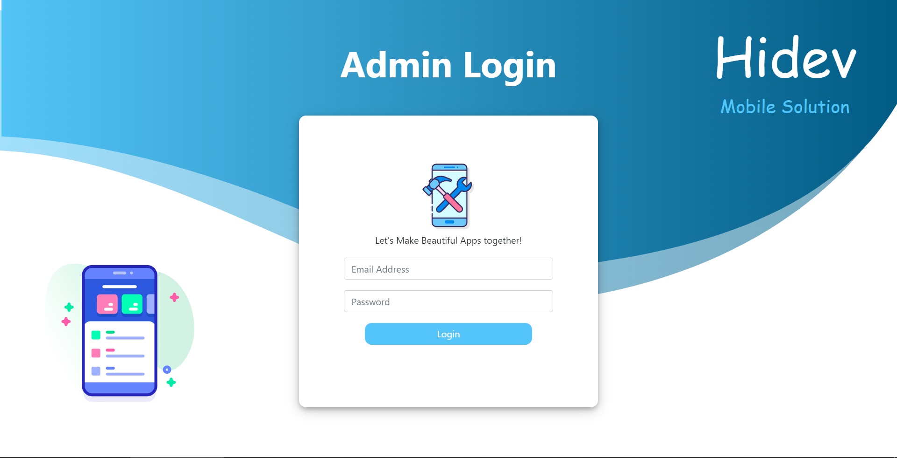

# Hidev - Make Beautiful Apps

Its my end semester project for a course "Web Technologies". The whole design I developed here is an inspiration from my favortie Flutter Developer <a href="https://github.com/MarcinusX">Marcin Szałek</a> and his blog <a href="https://fidev.io">Fidev</a>.

Yes, I copied the damn name from his blog as well ;p

## Languages/Tools
I'm not into web development very much so that's why I used some very simple and basic stuff starting with:

1. HTML

2. CSS

3. BOOTSTRAP

4. PHP

5. JavaScript/jQuery (very little)

6. mySQL (database)

## Screen Shots
